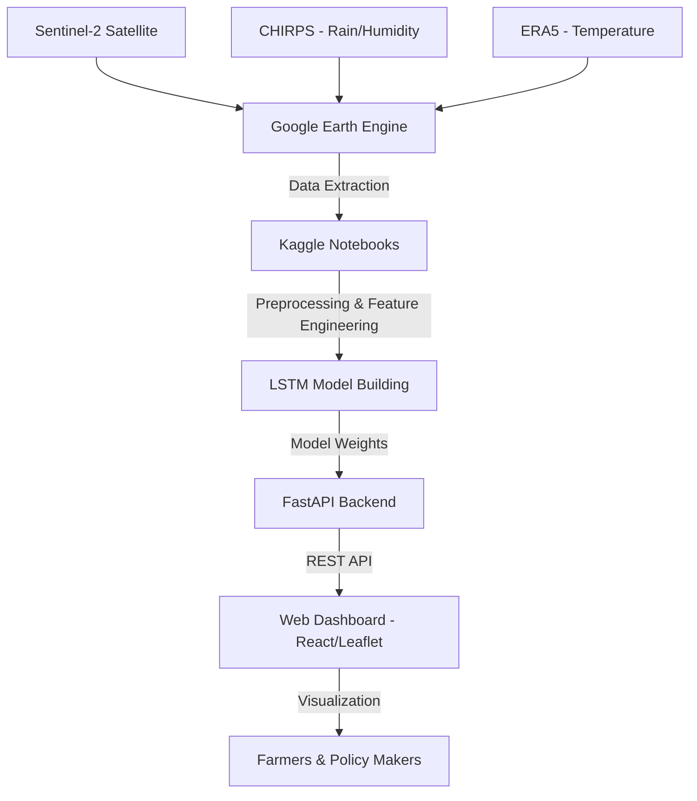

# 🌾 RiceVision

## Satellite & AI-Powered Rice Crop Monitoring System for Sri Lanka

**RiceVision** is a data-driven agricultural intelligence platform designed to monitor rice cultivation across Sri Lanka. By fusing multi-source remote sensing data with **Deep Learning (LSTM)**, the system provides near real-time insights into crop growth, health, and potential risks.

The platform supports **paddy crop stage detection, health monitoring, yield forecasting, and the detection of anomalies and pest outbreaks** to ensure food security and optimized farming.

---

## 📌 Project Motivation

Rice is the heart of Sri Lanka’s agriculture, yet it faces constant threats from climate instability and biological risks. RiceVision addresses:

* 🌦️ **Climate Variability** – Detecting heat stress and drought using ERA5 and CHIRPS data.
* 🐛 **Biological Threats** – Early detection of pest outbreaks (BPH, Rice Blast, Paddy Bug).
* 📈 **Yield Uncertainty** – Providing data-backed forecasts to assist policy planning.
* 🕒 **Operational Gaps** – Moving from manual field inspections to automated satellite-based assessments.

---

## 🚀 Key Features

### 📡 Multi-Source Data Fusion

* **Satellite Imagery:** Sentinel-2 MSI (10m - 20m resolution).
* **Rainfall & Humidity:** CHIRPS (Climate Hazards Group InfraRed Precipitation with Station data).
* **Temperature:** ERA5 (ECMWF Reanalysis v5).

### 📊 Advanced Analytics

* **Paddy Crop Stage Detection:** Real-time tracking of the growth cycle (Vegetative, Reproductive, Ripening).
* **Health Monitoring:** Analyzing spectral signatures (NDVI, NDWI, NDRE) to assess plant vigor.
* **Yield Forecasting:** Predictive modeling to estimate final harvest weight based on historical and seasonal trends.
* **Anomaly & Pest Outbreak Detection:** Identifying abiotic stress (Flood/Drought) and biotic stress (Pests/Diseases).

### 🧠 Deep Learning Engine

* **LSTM (Long Short-Term Memory):** Utilizing sequential time-series data to capture the temporal dynamics of crop growth and stress progression.

---

## 🏗️ System Architecture

---

## 🧪 Technologies Used

### 🌐 Data & Remote Sensing

* **Google Earth Engine (GEE):** Large-scale geospatial data extraction and initial preprocessing.
* **Sentinel-2 MSI:** Optical and Red-Edge bands for vegetation indices.
* **CHIRPS & ERA5:** Climate variables integration.

### 🧠 Machine Learning & Data Science

* **Platform:** Kaggle (Model training and data preprocessing).
* **Library:** TensorFlow / Keras.
* **Model:** **LSTM (Long Short-Term Memory)** for time-series classification and regression.
* **Pandas/NumPy:** Data manipulation and normalization.

### 🖥️ Backend & Deployment

* **FastAPI:** High-performance Python-based REST API for model inference.
* **Supabase:** Database management and authentication.

### 🎨 Frontend

* **React.js:** Interactive user interface.
* **Leaflet.js:** Geographic visualization and heatmaps.
* **Tailwind CSS:** Modern, responsive styling.

---

## 📊 Use Cases

* 🧑‍🌾 **Farmers:** Receive alerts on pest risks and stage-specific health advice.
* 🏛️ **Government (DOA):** Monitor national rice production and identify disaster-hit zones.
* 🌾 **Researchers:** Access high-resolution temporal data on Sri Lankan rice cultivars.

---

## 👥 Team

**RiceVision** is developed by the **Software Development Group Project (SDGP)** team at the **Informatics Institute of Technology (IIT) Sri Lanka**, in collaboration with the **University of Westminster, UK**.

---
